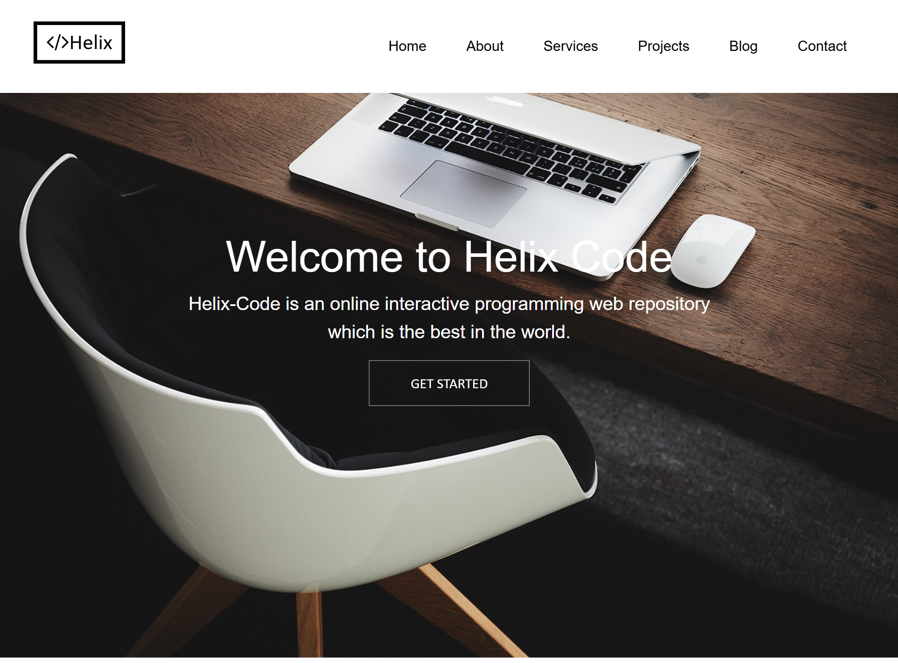
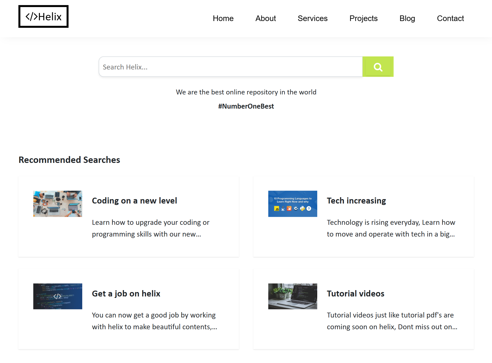
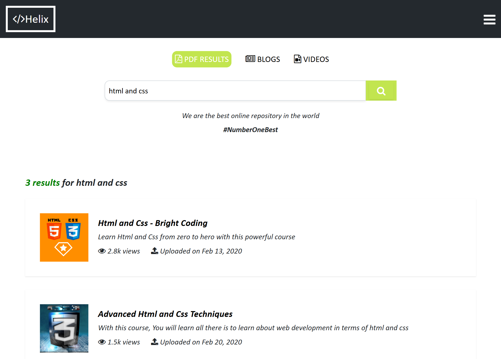

# Helix Code 2.0
This project is a revamped version of Helix Code found here -> [https://github.com/Xcoder-Creator/Helix-Code](https://github.com/Xcoder-Creator/Helix-Code)

## How to Run
1. Clone the repository to your local machine.
2. Open the project folder in your browser and load `index.html`.

## Screenshots

### Home Page

### Search Results Page

## Tech Stack
- HTML5
- CSS3
- Bootstrap
- jQuery
- No build tools
- No frameworks

## Features
- Responsive layout
- Multi-page website structure
- Clean and simple UI design
- Bootstrap-based grid system

## Project Status
This project is no longer actively maintained. It exists as an archive of my frontend work from 2022.

## What I’d Do Differently Today
- Replace jQuery with modern JavaScript or a framework like React
- Use CSS Grid and Flexbox more extensively
- Improve accessibility (ARIA, keyboard navigation)
- Refine the user interface with better color schemes and design themes

## License
This project is for educational and demonstration purposes.